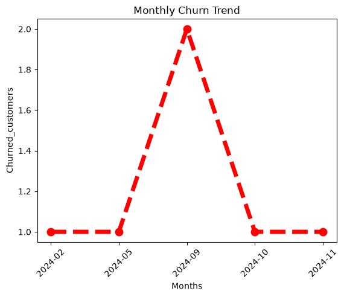
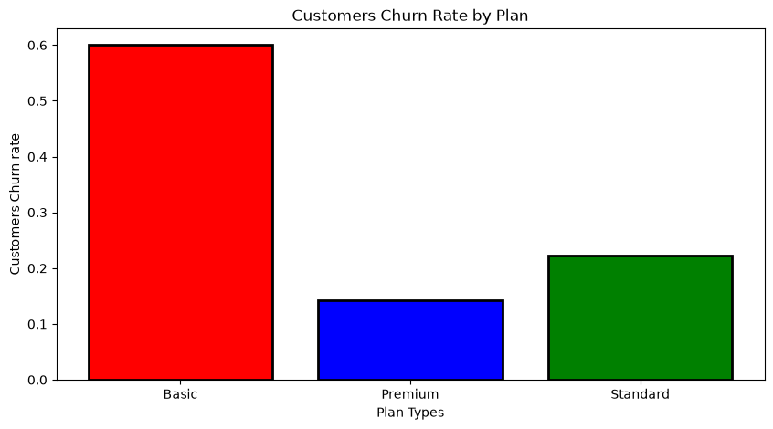
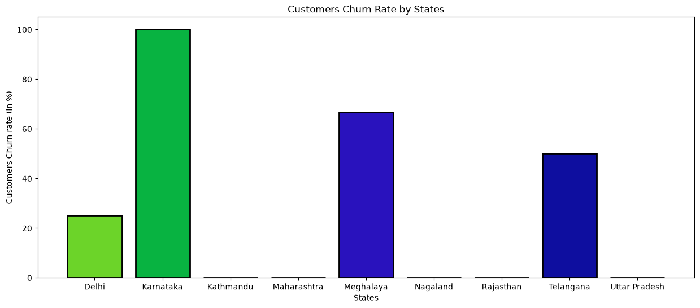
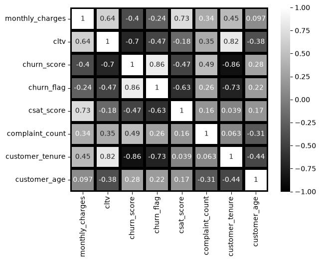
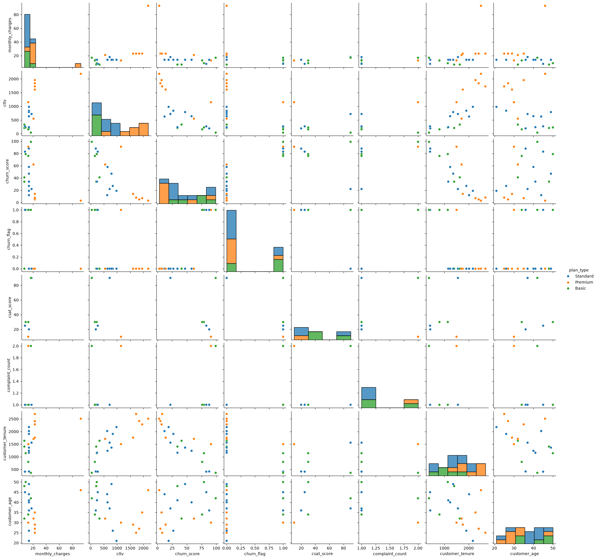

<div align="center">

# Customer Churn Analysis

### End-to-End Data Analytics Project

Python • SQL • Pandas • NumPy • Matplotlib • Seaborn • SQLite

[](https://www.python.org/)
[](https://pandas.pydata.org/)
[](https://numpy.org/)
[](https://matplotlib.org/)
[](https://seaborn.pydata.org/)
[](https://www.sqlite.org/)

</div>

---

## About the Project

Customer churn is an important problem for subscription-based businesses because losing customers can affect both recurring revenue and long-term customer value.

In this project, I analyzed customer, subscription, and support data to understand where churn was happening and what patterns could be seen across contract type, subscription plan, acquisition source, location, support activity, cancellation reasons, and customer value.

The project follows a complete data analytics workflow:

**SQL Data Extraction → Data Cleaning → Feature Engineering → EDA → Visualization → Insights → Business Action Areas**

The dataset contains 21 customers and three relational source tables.

---

## Business Questions

The analysis focused on questions such as:

- What is the overall churn rate?
- Which contract type has the highest churn?
- Which subscription plan has the highest churn?
- How does churn vary by acquisition source?
- When did churn events occur?
- Are churn cases concentrated in certain locations?
- What are the most common cancellation reasons?
- Is support activity associated with churn?
- Which customers fall into the high-risk segment?
- What does churn look like from a customer-value perspective?

---

## Key Numbers

| Metric | Result |
|---|---:|
| Customers | 21 |
| Overall churn rate | 28.57% |
| Retention rate | 71.43% |
| Customers churned | 6 / 21 |
| Monthly contract churn | 55.56% |
| Annual contract churn | 8.33% |
| Monthly vs annual churn | ~6.7× |
| Monthly charges tied to churn | 73.94 |
| Churned customer CLTV | 2,047 |

---

# Key Findings

## 1. Contract type shows the clearest churn gap

| Contract Type | Churn Rate |
|---|---:|
| Monthly | 55.56% (5/9) |
| Annual | 8.33% (1/12) |

Monthly-contract customers had an observed churn rate about 6.7 times higher than annual-contract customers.

Five of the six observed churn cases were monthly-contract customers.

---

## 2. Basic had the highest observed churn rate

| Plan | Churn Rate |
|---|---:|
| Basic | 60.00% (3/5) |
| Standard | 22.22% (2/9) |
| Premium | 14.29% (1/7) |

Basic had the highest plan-level churn rate and accounted for half of the observed churn cases.

Looking at customer value gives a different perspective: the single churned Premium customer contributed 1,150 of the 2,047 churned CLTV, which is about 56% of the total churned CLTV.

---

## 3. Referral customers had a high observed churn rate

| Acquisition Source | Churn Rate |
|---|---:|
| Referral | 83.33% (5/6) |
| Paid | 16.67% (1/6) |
| Organic | 0.00% (0/9) |

All five churned Referral customers were on monthly contracts.

Because of this overlap, acquisition source and contract type should be looked at together rather than in isolation.

---

## 4. September 2024 had the highest number of churn events

September 2024 recorded:

- 2 of the 6 observed churn events
- 33.33% of all observed churn cases

The other observed churn months each had one churn event.

---

## 5. Churn was concentrated in a few observed locations

All six observed churn cases came from:

- Karnataka
- Meghalaya
- Telangana
- Delhi

| Location | Observed Churn Rate |
|---|---:|
| Karnataka | 100% (2/2) |
| Meghalaya | 66.67% (2/3) |
| Telangana | 50% (1/2) |
| Delhi | 25% (1/4) |

These groups are small, so the location-level percentages should be treated as signals for further investigation rather than broad geographic conclusions.

---

## 6. Competitor switching was the most common cancellation reason

| Cancellation Reason | Share of Churn Cases |
|---|---:|
| Switched to competitor | 33.33% |
| Too expensive | 16.67% |
| Not enough content | 16.67% |
| Poor streaming quality | 16.67% |
| Forgot to cancel trial | 16.67% |

Competitor switching was the most frequently recorded cancellation reason in the dataset.

---

## 7. Support activity was strongly associated with observed churn

Seven customers had recorded support activity.

Among those customers:

- 6 of 7 churned
- All 4 recorded escalations were associated with churned customers
- Escalation vs churn correlation was 0.47

This is an observed association from a very small support sample and does not establish causation.

---

## 8. Rule-based churn risk segmentation

Customers were grouped using the existing churn score:

| Risk Segment | Score Rule | Customers | Churned |
|---|---|---:|---:|
| High | > 70 | 6 | 6 |
| Medium | 50–70 | 2 | 0 |
| Low | < 50 | 13 | 0 |

All six observed churners were in the High Risk group.

This is a rule-based segmentation based on the existing churn score. It is not a machine-learning prediction model.

---

# Analysis Workflow

## 1. Data Extraction

Connected the SQLite database to Python using `sqlite3` and loaded the three relational tables into Pandas.

## 2. Data Cleaning

The dataset was cleaned by:

- Handling missing values
- Converting date columns
- Standardizing categorical values
- Removing low-value columns
- Checking for duplicates
- Validating data types

## 3. Feature Engineering

Additional analytical features were created, including:

- Customer tenure
- Customer age
- Churn risk category

## 4. Exploratory Data Analysis

The analysis included:

- GroupBy analysis
- Aggregations
- Churn analysis by contract type
- Churn analysis by subscription plan
- Acquisition-source analysis
- State-level analysis
- Time-based churn analysis
- Pivot tables
- Correlation analysis

## 5. Visualization

Matplotlib and Seaborn were used to create charts for the main patterns found during the analysis.

## 6. Business Interpretation

The final step was to turn the analytical results into business-focused findings and areas that could be investigated further.

---

# Visualizations

## Monthly Churn Trend



## Churn Rate by Plan



## Churn Rate by State



## Correlation Heatmap



## Pairplot



---

# Customer Value

The churn analysis was not limited to customer count.

The six churned customers were associated with:

- **73.94** in monthly charges
- **2,047** in churned CLTV

The 73.94 figure is the sum of monthly charges for churned customers in this dataset. It should be viewed as monthly charges tied to churn, not as verified historical revenue loss.

---

# Business Action Areas

Based on the patterns found in the data, the following areas stood out for further investigation:

### Monthly Contracts

Investigate why monthly customers show a much higher observed churn rate than annual customers and whether contract migration or retention initiatives could help.

### Referral + Monthly Customers

Look more closely at customers who came through Referral and were also on monthly contracts, since the two variables overlap strongly in the observed churn cases.

### Geographic Concentration

Investigate whether pricing, technical problems, streaming quality, or customer support contributed to churn in the affected locations.

### Cancellation Reasons

Explore competitor offerings, pricing, content satisfaction, streaming quality, and trial cancellation behavior.

### High-Risk Customers

Combine churn risk with customer value when identifying customers that may need additional attention.

---

# Project Structure

```text
Customer-Churn-Analysis/
│
├── data/
│   ├── churn_data.csv
│   └── customer_churn.db
│
├── notebooks/
│   └── Customer_Churn_Analysis.ipynb
│
├── reports/
│   └── customer_churn_insights_action_plan.pdf
│
├── visuals/
│   ├── churn_rate_by_plan.png
│   ├── churn_rate_by_state.png
│   ├── correlation_heatmap.png
│   ├── monthly_churn_trend.png
│   └── pairplot.png
│
├── .gitignore
├── README.md
└── requirements.txt

```

# Dataset

The SQLite database contains three source tables:

- `db_customer`
- `db_subscription`
- `db_support`

The tables were extracted using SQL and loaded into Pandas for cleaning, transformation, analysis, and visualization.

---

# Tools & Technologies

| Technology | Purpose |
|---|---|
| Python | Data analysis and processing |
| SQLite | Relational database |
| SQL | Data extraction |
| Pandas | Data manipulation |
| NumPy | Numerical operations |
| Matplotlib | Data visualization |
| Seaborn | Statistical visualization |
| Jupyter Notebook | Analysis environment |

---

# Project Files

### `Customer_Churn_Analysis.ipynb`

The main notebook containing the complete analysis, including:

- SQL data extraction
- Data cleaning
- Feature engineering
- Exploratory data analysis
- Aggregations
- Pivot tables
- Correlation analysis
- Visualizations
- Churn risk segmentation
- Business interpretation

### `customer_churn_insights_action_plan.pdf`

A business-facing report containing the major findings, interpretation notes, and action areas.

### `visuals/`

Contains the final charts generated during the analysis.

---

# How to Run

### 1. Clone the repository

```bash
git clone https://github.com/vraw-33/customer-churn-analysis.git
cd customer-churn-analysis
```

### 2. Install the required packages

```bash
pip install -r requirements.txt
```

### 3. Open the notebook

Open:

```text
notebooks/Customer_Churn_Analysis.ipynb
```

Run the notebook using a Python/Jupyter environment with the required packages installed.

---

# Limitations

This project uses a small 21-customer dataset, so the findings should be interpreted carefully.

Main limitations include:

- Small overall sample size
- Small groups for some locations and support categories
- Observed association does not imply causation
- Risk segmentation is rule-based rather than machine-learning based
- Churn percentages are within-group rates
- Monthly charges tied to churn are not verified historical revenue loss

The results are best treated as exploratory business signals and as a demonstration of an end-to-end analytics workflow.

---

# Future Improvements

Possible next steps include:

- Analyze a larger real-world customer dataset
- Build a machine-learning churn prediction model
- Evaluate feature importance
- Test the statistical significance of churn differences
- Perform cohort retention analysis
- Analyze monthly recurring revenue trends
- Build an interactive Power BI or Tableau dashboard
- Develop customer-level retention recommendations

---

# Skills Used

- SQL + Python integration
- SQLite database querying
- Data cleaning
- Data transformation
- Feature engineering
- Exploratory Data Analysis
- GroupBy and aggregation
- Pivot tables
- Data visualization
- Customer churn analysis
- Customer value analysis
- Rule-based segmentation
- Business-oriented interpretation

---

# Report

[View the Customer Churn Insights & Action Plan](reports/customer_churn_insights_action_plan.pdf)

---

<div align="center">

### Built as a practical Data Analytics portfolio project

**Vaibhav Rawat**

[GitHub](https://github.com/vraw-33)

</div>

